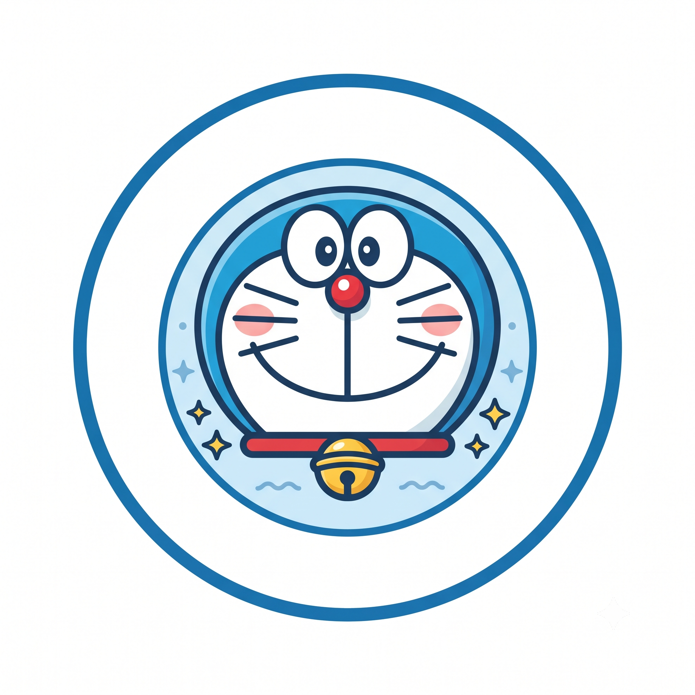

<div align="center">
  
<h1 align="center">
  
  DoraPocket - Anything Language Models
</h1>

<!-- Core Stack & Framework Badges -->
<p align="center">
  <a href="https://www.python.org/"></a>
  <a href="https://pytorch.org/"></a>
  <a href="https://huggingface.co/TheSon2202"></a>
  <a href="https://www.kaggle.com/"></a>
  <a href="https://wandb.ai/"></a>
  <br />
  <a href="https://aclanthology.org/2026.semeval-1.25/"></a>
  <a href="https://github.com/astral-sh/uv"></a>
  <a href="LICENSE"></a>
</p>

**An End-to-End Open-Source LLMOps Framework for Vietnamese & Multimodal LLMs**  
*Fine-Tuning, Temporal Mixture-of-Experts (MoE), Vision-Language Models, Agentic RAG, and Streamlit Deployment.*

<p align="center">
  
</p>

[Overview](#-overview) • [Key Highlights](#-key-highlights) • [Supported Models & Modules](#-supported-models--modules) • [Pretrained Weights](#-hugging-face-models--pretrained-weights) • [Installation](#%EF%B8%8F-installation) • [Quick Start](#-quick-start) • [Citation](#-Citation)

</div>

---

## 📌 Overview

**DoraPocket - LLMOpsSys** is a unified Large Language Model (LLM) ecosystem engineered specifically for Vietnamese Natural Language Processing and Multimodal AI workflows. The system encapsulates full end-to-end Machine Learning pipelines—ranging from model training, fine-tuning, and dynamic Mixture-of-Experts (MoE) optimizations to agentic Retrieval-Augmented Generation (RAG) and interactive web frontend interfaces.

**You can look for my Temporal-Moes idea at here: `10.18653/v1/2026.semeval-1.25`**

---

## ✨ Key Highlights

* **Temporal Mixture-of-Experts (MoE):**
  * Dynamic routing designed for temporal/longitudinal sequence tasks and continuous emotion prediction (Valence/Arousal).
  * Native architecture support for English transformers and **BamiBert** for Vietnamese language tasks.
* **Automated Fine-Tuning Pipelines:**
  * Out-of-the-box support for SemEval sequence emotion datasets, DeepSeek, MiniGemma3, and minikimi.
* **Multimodal Integration (`DoraVisionTransformer`):**
  * Core vision-language modules enabling dual image analysis and text-image generation tasks.
* **Modern Developer Tooling:**
  * Fast virtual environment resolution via [`uv`](https://github.com/astral-sh/uv) and a full-featured Streamlit UI (`app.py`).

---

## 🧩 Supported Models & Modules

| Module / Directory | Target / Task | Description |
| :--- | :--- | :--- |
| `finetune/valence_arousal_prediction` | Valence/Arousal Regression | Primary fine-tuning pipeline for longitudinal SemEval benchmarks |
| `finetune/BamiBert-moe` | Vietnamese Temporal MoE | Sparse Mixture-of-Experts architecture integrated with BamiBert backbone |
| `DoraGen` / `DoraVisionTransformer` | Vision-Language Processing | Multi-modal feature extraction, image analysis, and generation |
| `deepseek` / `minigemma3` / `minikimi` | Edge & Small LLMs (SLMs) | Efficient fine-tuning (PEFT/QLoRA) setups for lightweight LLMs |
| `rag/` | Agentic RAG | Retrieval-Augmented Generation pipeline tuned for Vietnamese contexts |
| `frontend/` / `app.py` | Web Dashboard | Interactive Streamlit frontend interface for live system demos |

---

## 🤗 Hugging Face Models & Live Demos
We publicly release our pretrained model weights and interactive web application demos on Hugging Face:

| Model / Architecture | Backbone | Pretrained Weights | Live Web Demo |
| :--- | :--- | :---: | :---: |
| **BamiBert MoE Sentiment** | BamiBert | [Download Weights ↗](https://huggingface.co/TheSon2202/bamibert-moe-sentiment) | [Launch Space Demo ↗](https://huggingface.co/spaces/TheSon2202/bamibert-moe-vietnamese-sentiment-analytst) |
| **Temporal MoEs RoBERTa** | RoBERTa | [Download Weights ↗](https://huggingface.co/TheSon2202/Temporal-MoEs-RoBERTa) | [Launch Space Demo ↗](https://huggingface.co/spaces/TheSon2202/temporal-moes-roberta-sentiment) |

---

## 🛠️ Installation

This project recommends using **`uv`** for high-speed package and virtual environment management:

```bash
# Clone repository
git clone [https://github.com/your-username/LLMOpsSys.git](https://github.com/your-username/LLMOpsSys.git)
cd LLMOpsSys

# Create a virtual environment using uv
uv venv

# Activate the virtual environment
# On Linux/macOS:
source .venv/bin/activate
# On Windows:
# .venv\Scripts\activate

# Install required packages
uv pip install -r pyproject.toml
```

## 🦥 Citation

If you use the ideas of Temporal-Moes, please cite this paper

```BibTex
@inproceedings{phuong-etal-2026-citd,
    title = "{CITD}@{UIT} at {S}em{E}val-2026 Task 2: Temporal Mixture-of-Experts for Longitudinal Valence and Arousal Prediction from Ecological Essays",
    author = "Phuong, Son The  and
      Ngo, My Thuy-Tra  and
      Minh Dao, Tri  and
      Nguyen, Duc-Vu",
    editor = "Kochmar, Ekaterina  and
      Ghosh, Debanjan  and
      North, Kai  and
      Komachi, Mamoru  and
      Zampieri, Marcos",
    booktitle = "Proceedings of the 20th {I}nternational {W}orkshop on {S}emantic {E}valuation (2026)",
    month = jul,
    year = "2026",
    address = "San Diego, California, USA",
    publisher = "Association for Computational Linguistics",
    url = "https://aclanthology.org/2026.semeval-1.25/",
    doi = "10.18653/v1/2026.semeval-1.25",
    pages = "167--175",
    ISBN = "979-8-89176-414-9",
}
```
